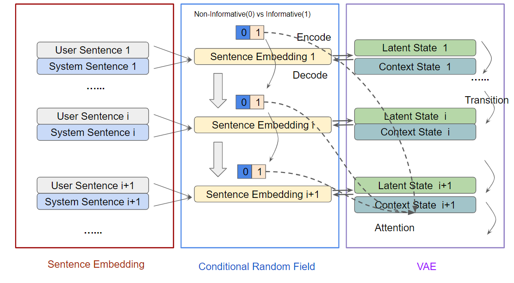

# TSAN-Dialogues

All configuration is in `params.py`. You should change `use_cuda=True` if you want to use GPU.

## Install Requirements

```bash
make install
```

## Dataset

First download the Ubuntu Chat Corpus from [here](https://daviduthus.org/UCC/).
Then generate samples from the corpus by running

```bash
make dataset data_path=path/to/your/ubuntu/corpus
```

If you want to use GloVe, download it [here](https://nlp.stanford.edu/projects/glove/).

## Train  

```bash
python train_crf_vrnn.py
```

or

```bash
python train_tree_vrnn.py
```

## Decode

```bash
python train_crf_vrnn.py --forward_only True --ckpt_dir run1585003537 --ckpt_name vrnn_5.pt
```

or

```bash
python train_tree_vrnn.py --forward_only True --ckpt_dir run1585003537 --ckpt_name vrnn_5.pt
```

## Interpret

```bash
python interpretion.py --ckpt_dir run1585003537 --ckpt_name vrnn_5.pt
```

## Model Architecture

